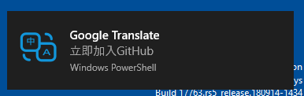
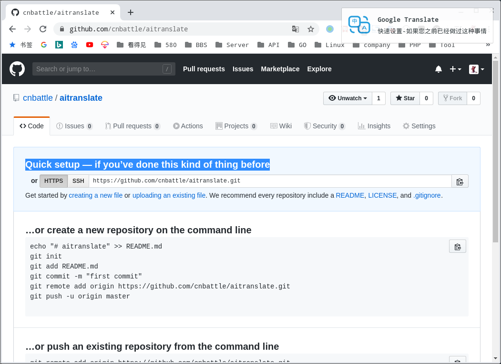

# ai translate

[](https://github.com/996icu/996.ICU/blob/master/LICENSE)

> 监听粘贴版新的英文内容并翻译成中文

> 仅在`Manjaro`/ `Windows 10`上测试,`Mac`等其他平台未知,有问题或建议请提交`Pull Requests`或`Issues`

|Linux| Windows 10|
|:---:|:---:|
|||

## 特色
 - 自动翻译 `clipboard` 为英语的内容
 - 支持 `Google Translate` 和 `YouDao Translate`
 - 开源,不用担心 `clipboard` 内容泄漏问题

## TODO

 - [ ] GUI系统托盘执行,实现托盘切换翻译渠道及运行模式
 - [ ] 增加测试代码

## 使用
### Linux or Mac
```
nohup ./aitranslate & 
```
### Windows 
```
start /b ./aitranslate
```

## Tips
> manjaro 可以开启`clipman`设置中的 `同步鼠标选择区`,实现选中自动翻译

## 依赖
### Linux `xsel`或`xclip`
```
// Manjaro/Arch:
sudo pacman -S xsel xclip
// Debian/Ubuntu
sudo apt-get install xsel xclip
// Fedora
sudo dnf install xsel xclip
```
### Windows 10 `PowerShell`

## screenshots
